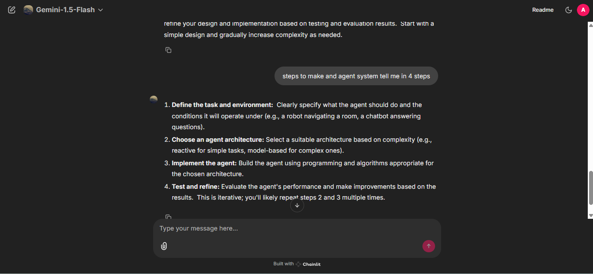
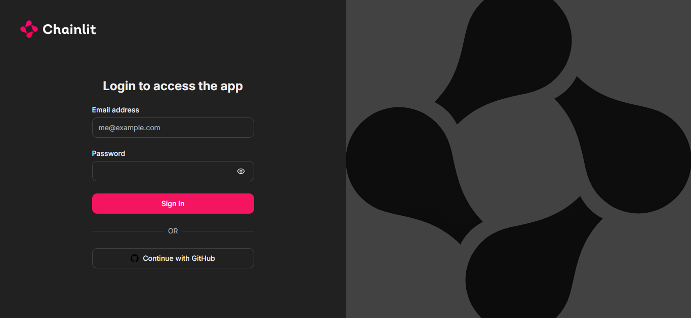
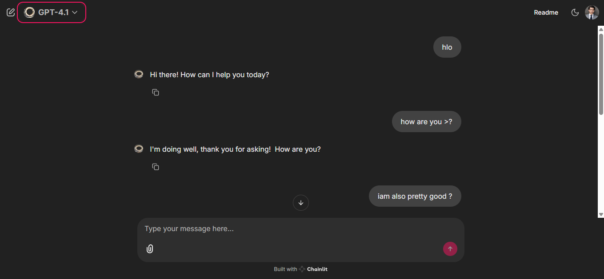

# 💬 **Chainlit Chatbot Interface** ✨

Welcome to **Chainlit**, a sleek, modern, and interactive chatbot interface that allows for clean conversations and seamless development experience. With features like real-time streaming and smooth chat profiles, this bot is built for developers looking to create sophisticated chat interfaces.

🔗 **GitHub Repository:** [chain_lit_bot_model](https://github.com/SARAMALI15792/chain_lit_bot_model.git)

---

## ✨ **Features**

- 🔐 **Modern Login Screen**: Secure and stylish login experience.
- 💬 **Smooth & Responsive Chat Interface**: Chat flows effortlessly with real-time message updates.
- ⚡ **Streaming Support**: Real-time updates for a seamless chat experience.
- 🧠 **AI-Powered Dashboard**: Manage and track your chatbot's performance.
- 🎨 **Smooth Chat Profiles**: Personalize each conversation for a unique user experience.
- 📦 **Clean Project Structure**: Easy to navigate and extend.
- ⚙️ **Easy Local Development** with **uv**: Ready for you to dive in and develop locally.

---

## 🖼️ **Screenshots** 📸

### 💬 **Chat UI**  
A sleek, modern interface where the magic happens.  


---

### 🔐 **Login Screen**  
Sleek and secure login screen.  


---

### 🧠 **Main Dashboard+ChatProfile**  
The heart of your Chainlit-powered chatbot experience.  


---

## 🚀 **How to Run This Project Locally**

Ready to run it locally? Follow these steps to get started!

### ✅ **Prerequisites**

Before you begin, make sure you have the following installed:
- [Python 3.8+](https://www.python.org/downloads/)
- [Git](https://git-scm.com/)
- [uv (Universal Virtualenv)](https://github.com/astral-sh/uv)

---

### 📥 **Clone & Run the Project**

```bash
# 1. Clone the GitHub repository
git clone https://github.com/SARAMALI15792/chain_lit_bot_model.git

# 2. Navigate into the cloned directory
cd chain_lit_bot_model

# 3. (Optional) Initialize a Chainlit project if needed
# uv init --package your_project_name

# 4. Open the project in your preferred code editor
code .       # or: cursor .

# 5. Run the chatbot app
uv run chainlit run app.py -w
